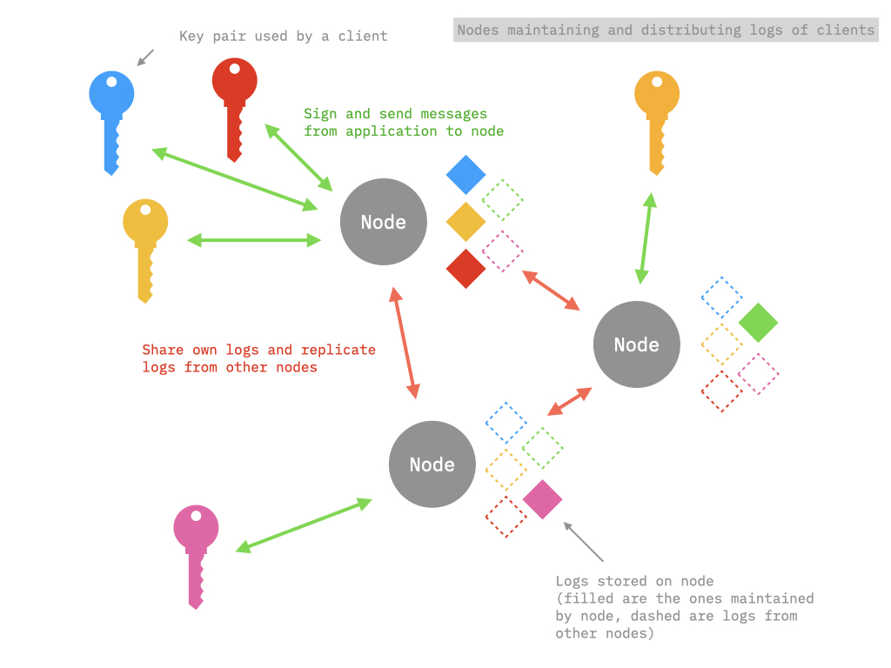

# Architecture

The p2panda network consists of **clients**, which create new data, and **nodes** which receive it. Nodes check first if all incoming data is valid before they store it. After storing the data, nodes discover other peers to sync the latest data with them.

One can roughly describe clients as *data creators* and nodes as *data distributors*. Clients generate a **key pair** when you start them for the first time. Key pairs are the most sensitive bit of information and only known to the client, usually stored locally for one user. It is used to sign newly created data, similar to a signature under a letter making sure your identity is proven when sending it somewhere else.

Newly created data by clients is sent directly to a node via a RPC API which is an interface to communicate with each other. Nodes check the incoming data and make sure its well-formed, cryptographically verified (eg. "is your signature correct?") and valid before storing it. Together all nodes in the network form a distributed, *eventually consistent* database of the data, fed by all clients around them. Nodes can not create any data themselves, they just make sure the data is stored somewhere for further transmission while keeping its structure and integrity consistent.

Nodes also *materialise* the data they store, which means they make it faster and easier to query it. Clients can not only create data but also request the node via the RPC API to send them what it knows about a certain topic, author or kind, like *"Send me all the posts from this user"* or *"What are the pictures attached to this event?"* to finally display the responses to the user in an interface.

## Overview

**Node**

* Holds all known data (append-only logs). Awaits signed messages from clients via an API which then are added to the logs and internally stored in the nodes database.
* Accepts queries to filter currently known data and returns it to the client via an API (materialized views).
* Verifies the consistency and signature of logs and rejects invalid ones.
* Finds other nodes (discovery).
* Distributes / syncs data with other nodes (replication).

**Client**

* Renders data in an user interface which got requested from node via API.
* Holds and manages the generated key pair and sensitive informations (private key).
* Signs new messages with private key and sends them via API to node.

## Federated vs. decentralised setups

Depending on your preferences and chosen trade-offs, a client and node can run on different computers or on the same one, sometimes even embedded within the same application if necessary.

This following table roughly compares the advantages of the different network topologies:

| Feature | Federated | Decentralised |
| --- | --- | --- |
| Works offline | :interrobang: | :heavy_check_mark: |
| Trust own node | :interrobang: | :heavy_check_mark: |
| Browser friendly | :heavy_check_mark: | :interrobang: |
| Static IP | :heavy_check_mark: | :interrobang: |
| Can be used by many | :heavy_check_mark: | :interrobang: |

With these two components a few setup configurations for p2panda are imaginable:

* Website (hosted via HTTP server) communicating with external node (hosted on dedicated p2panda hardware or any other machine).
* [Electron](https://www.electronjs.org) / [Tauri](https://tauri.studio) (or similar) Desktop application which contains both node and client.
* Website which contains both node and client (not possible right now due to browser limitations / performance bottlenecks).
