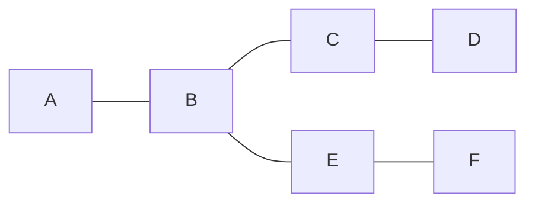
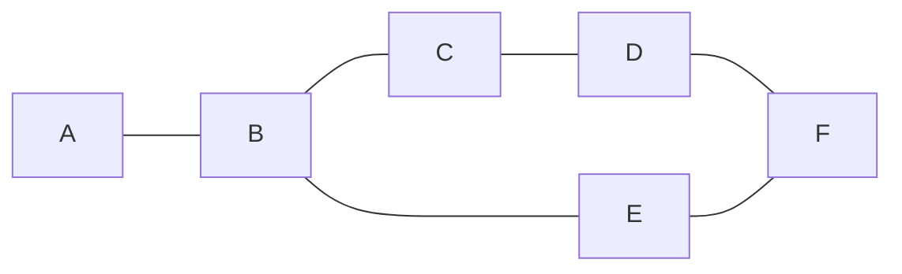
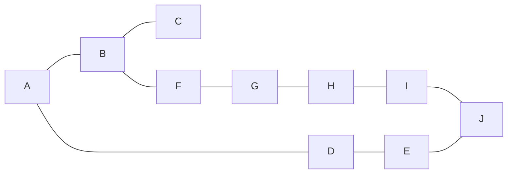
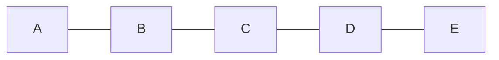

# Document

## Summary

A `Document` is a resolvable data type taking the form of a linked graph of operations. During a determinate process of ordering and reduction the graph can be reduced to a single data item matching the documents schema definition. Any two documents (replicas) which contain the same collection of operations will resolve to the same value.

In the p2panda network, Documents are materialised on nodes and the resultant document views are stored in the database.

Documents have a concept of multi-writer updates by different authors. This can be managed through a permissions system derived from KeyGroup membership which is not specified in this document.

## User stories

> Describe who is affected by your proposal and what changes they can expect by writing user stories about it. It can help to think about the questions: Why are we doing this? What use cases does it support? What is the expected outcome?

- As a developer I want to be able to work with distributed data types which are able to automatically and deterministically resolve concurrent updates.

## Documentation

> This section is a more formal description of the proposal, written as if it was a sub-section of the standard (for technical proposals) or a formal process or "fine print" for process proposals. It should be unambiguous and cover all known corner-cases. Formal language (such as protobuf schemas or binary header diagrams) is appropriate here.

### Document

Documents MUST have a single root 'CREATE' operation. All other operations which mutate the initial data are inserted from this point and, following an operations `previous_operations` field, connect together to form a directed acyclic graph.

The graph MUST contain only one root operation and there MUST be a path from the root to every other `Operation` contained in this `Document`. All `Operations` MUST contain a collection containing the hashes of all current graph tips known at the time of publication.

All operations in a document MUST follow the documents `Schema` definition. This is defined by the root CREATE operation.

The topological ordering od a Document MUST be deterministic, any Document replicas which contain the same Operations MUST resolve to the same value.

An implementation of Document might look something like this.

```
{
    id: <HASH>
    schema: <HASH>
    operations: [<OPERATION>]
}

```

### Document View (Instance)

A document view refers to the resolution of a document given a certain collection of operations. It takes the form of a data item matching the documents schema and contains the values derived from applying all operations from the graph in their sorted order.

```
{
    *key: <VALUE>
    ...
}
```

A document view can be uniquely identified by the document id, and the hashes of the tips of all (merged or not) document branches.

```
id: A/DF
```



```
id: A/DF
```



```
id: A/CEJ
```



```
id: A/E
```



### Operation

[draft spec](https://laub.liebechaos.org/7cGHWPCcR8eoZBkk-X9R4w?edit)

## Examples

> Concrete examples to expand understanding.

See: https://github.com/p2panda/p2panda/pull/169

## Rationale, alternatives and drawbacks

> Why is this design the best in the space of possible designs? What other designs have been considered and what is the rationale for not choosing them? What is the impact of not doing this? Why should we _not_ do this?

In order to achieve consistent resolution of documents across different replicas, we have chosen to linearise a graph of operations through topological sorting before applying all operations in sorted order. This means operations are applied in a last-write-wins manner. Other approaches are to resolve conflicts as they happen via something like a merge node.
