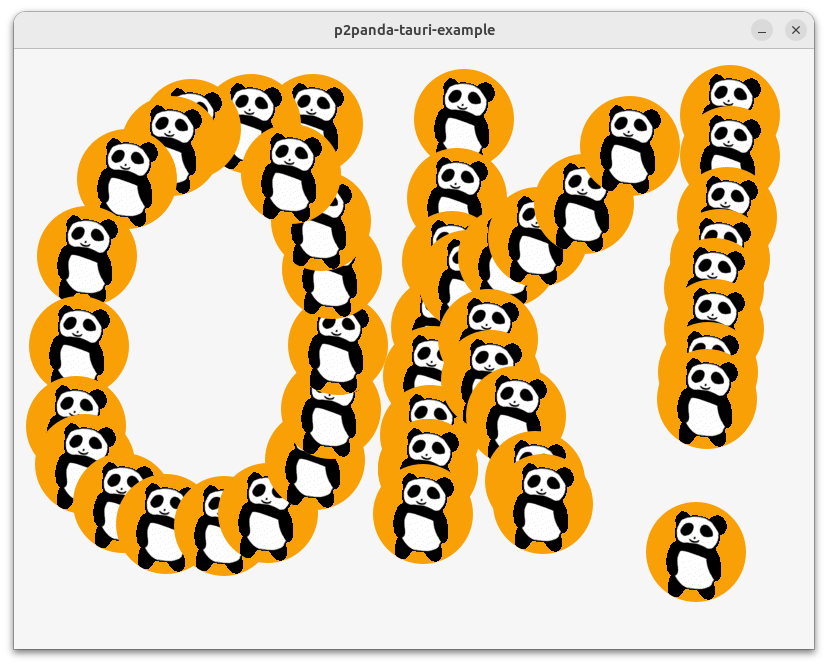

In this tutorial we will see how to embed an `aquadoggo` node in a Tauri app. Tauri is a framework for build apps which have a Rust backend and WebView frontend which will compile for all major desktop platforms (mobile coming soon). This means we can easily package our `aquadoggo` node alongside a frontend written in your favorite web framework (or none at all).

In this tutorial we will focus on the backend code, where we'll embed our node, configure secure persistent storage for both WebView (LocalStorage) and node data, demonstrate useful configuration flows, define commands callable from the frontend and populate the node with app schemas on startup. We'll look at the frontend code which demonstrates advanced GraphQL queries and how to publish and retrieve blobs in the following tutorials.

## What do I need?

- NodeJS
- Rust
- Tauri dependencies
- Editor
- Terminal

:::info Never worked with Rust and/or Tauri before?

This tutorial requires you to have a working Rust environment and all Tauri dependencies installed. If you have never worked with Rust and/or Tauri before this is no problem! Setting it up is fairly easy and besides using some basic command line commands there is no more Rust knowledge required to make the node run on your computer.

:::

<details>
  <summary>How do I install NodeJS?</summary>
  <div>
    You can check out the official [Installing Node.js via package manager](https://nodejs.org/en/download/package-manager/) guidelines here. But we would recommend you installing a NodeJS version manager like [nvm](https://github.com/nvm-sh/nvm), or even better [n](https://github.com/tj/n). We used the NodeJS version `18.17.0` for this tutorial.
  </div>
</details>

<details>
  <summary>How do I install Rust & Tauri dependencies?</summary>
  <div>  
  Make sure you have a working Rust environment installed on your computer before you begin with the tutorial. You can check this by running `rustc --version` in your terminal. This tutorial was written with Rust version `1.63.0` but it will probably also work with other versions.

If you don't have Rust installed yet or you need just the Tauri dependencies you can follow the steps from the Tauri website: [Tauri: Getting Started](https://tauri.app/v1/guides/getting-started/prerequisites).

  </div>
</details>

:::info What is `aquadoggo`?

If you aren't familiar with `aquadoggo` then I recommend checking out the ["How to run a node"](/tutorials/aquadoggo) tutorial before you do this one. It focuses on using `aquadoggo` on the command line, but all the features and configuration parameters are the same when working with it programmatically.

:::

## Download the application code

Everything we need for this tutorial is in the `p2panda/tauri-example` repository. Download the code and install NodeJS dependencies like so.

```bash
# Clone the `tauri-example` git repository
git clone https://github.com/p2panda/tauri-example

# Move into the folder you've just created
cd tauri-example

# Install NodeJS dependencies
npm install
```

## Run the application

First we're going to simply run the application, this will compile the front and backend and launch the app in dev mode. The first step (compilation) will likely take... a while.... don't worry though, this is only the case the first time you run the command, after that only incremental builds are required and things will be a lot quicker.

```bash
# Run the tauri app in dev mode
npm run tauri dev
```

:::info What's "dev" mode?

When we launch an app in "dev" mode it means we are still in development, and so rather than an optimized build with production settings, we want to work in a developer friendly environment. In this case that means that means we don't persist any app data to the filesystem between runs and want code hot-reloading (the app updates automatically when we edit the code).

:::

You should see some output in your terminal like this (missing out the long compilation process):

```bash
npm run tauri dev

> p2panda-tauri-example@0.0.0 tauri
> tauri dev

     Running BeforeDevCommand (`npm run dev`)

> p2panda-tauri-example@0.0.0 dev
> vite


  VITE v4.5.2  ready in 135 ms

  ➜  Local:   http://localhost:1420/
  ➜  Network: use --host to expose
...
...
...
        Info Watching /home/sandreae/Code/tauri-example-test/src-tauri for changes...
    Finished dev [unoptimized + debuginfo] target(s) in 0.19s
Go to http://0.0.0.0:2020/graphql to use GraphQL playground
Peer id: 12D3KooWPzHvt52CYkYPvejsBjgjcsqyBszcEQrDhDp6RSdYx6qx
Node is listening on 0.0.0.0:2022
Schema migration: app schemas successfully deployed on initial start-up
```

We're using `vite` to package the frontend code and assets, you can see that a dev server is started at `http://localhost:1420/`. This is where tauri will look for the frontend code during development. Next the rust code is compiled and eventually the app is launched. The last four lines are logging from the `aquadoggo` node which has now started up. You can go to `localhost:2020/graphql` to check the GraphQL playground is being served correctly.

The app window should now have opened, it'll be a blank screen.... not very interesting... until you start clicking! Then you can draw pointless messages like this with panda gif stickers (yay!):



## How does it all work?

A _lot_ happened there, but it's worth pointing out now that you don't actually need to know much about it if you just want to start hacking on a web client (for that you can go straight to `src/` where all the frontend JavaScript code is). This tutorial would be quite short if we didn't dig a bit deeper though. Let's take it step by step.

As we saw from the logging, a node _did_ start up, so where did it come from?

## Embedding an `aquadoggo` node

### Add `aquadoggo` to `Cargo.toml`

The absolute first thing we need to do to use `aquadoggo` in any rust project is to add it as a dependency in our `Cargo.toml` file. We'll need `p2panda-rs` for creating an identity for the node too so let's add that now as well.

```toml
[dependencies]
p2panda-rs = "0.8.1"
aquadoggo = "0.7.1"
```

The `aquadoggo` crate gives us access to a programmatic API with which we can configure, start, migrate data to, and stop our node.

:::info What about publishing and querying data?

This is all done from the frontend code via the `GraphQL` API!

:::

### Start the node

We can start a node like this:

```rust
use aquadoggo::{Configuration, Node};
use p2panda_rs::identity::KeyPair;

// We're using `tokio::runtime` to make main async.
#[tokio::main]
async fn main() {
    // Generate a key pair for the node identity.
    let key_pair = KeyPair::new();

    // Construct a default configuration.
    let config = Configuration::default();

    // Start the node!
    let node = Node::start(key_pair, config).await;

    // The node is already started now, wait here on the blocking future `on_exit` which resolves when any of the node's services exit with an
    // error or because of user closure.
    node.on_exit().await;

    // Finally we call `shutdown` to gracefully close all remaining services, including database connections.
    node.shutdown().await;
}
```

You can see the complete runtime life of a node in the above code, mostly it spends it's time running in the background, responding to HTTP and GraphQL requests from clients, and replicating with other nodes. The main point of interest for this tutorial is how we wrap this simple code into a tauri app and, crucially, configure the node at runtime.

## Tauri integration

### Project structure

Let's take a look into the project directory `src-tauri/`:

```
├── build.rs
├── Cargo.lock
├── Cargo.toml
├── icons
├── resources
├── src
│   └── main.rs
└── tauri.conf.toml
```

To anyone who's worked with the Rust programming language much of this will look very familiar. We have a `Cargo.toml` and `Cargo.lock` for managing dependencies, and a `src/` folder where our project code lives. Everything else here are Tauri specific conventions, I'll expand on the one relevant for this tutorial a little.

:::info Tauri has much more

There are many useful features of Tauri that we won't touch on at all in this tutorial, checkout out the ["features page"](https://tauri.app/v1/guides/features/) for more info.

:::

#### `build.rs`

- the default tauri build file, we won't do anything here in this tutorial

#### `icons`

- icons for your app in many platform specific shapes and sizes. We won't do anything here in this tutorial check the tauri docs on how to [generate your own icons](https://tauri.app/v1/api/cli#icon).

#### `resources/`

- resources we want access to at application runtime can be placed here and retrieved via the tauri API.

#### `tauri.conf.toml`

- this is our Tauri app configuration file, there are many features with fine grained configurable options

:::info Where did all this come from?

You can scaffold a tauri project using their `create-tauri-app` tool which is available via `cargo`, `npm` and more. This very project was scaffolded in that way. More information on their ["Quick Start"](https://tauri.app/v1/guides/getting-started/setup/) page.

:::

Ok, let's get into some code now, we'll step through building a tauri app, starting our node and getting access to useful logs.

#### Build the tauri app

```rust
// src/main.rs
fn main() {
    tauri::Builder::default()
        .run(tauri::generate_context!())
        .expect("error while running tauri application");
}
```

This is the tauri builder, the code above builds an app which... doesn't do anything... let's already add our `aquadoggo`.

### Launching `aquadoggo`

```rust
// src/main.rs
// highlight-start
use aquadoggo::{Configuration, Node};
use p2panda_rs::identity::KeyPair;

/// Setup handler where we launch our `aquadoggo` before the app starts.
fn setup_handler(app: &mut tauri::App) -> Result<(), Box<dyn std::error::Error + 'static>> {
    let key_pair = KeyPair::new();
    let config = Configuration::default();

    tauri::async_runtime::spawn(async {
        let node = Node::start(key_pair, config).await;
        node.on_exit().await;
        node.shutdown().await;
    });

    Ok(())
}
// highlight-end

fn main() {
    tauri::Builder::default()
        // highlight-start
        // Add setup handler which launches our node before the app runs.
        .setup(setup_handler)
        // highlight-end
        .run(tauri::generate_context!())
        .expect("error while running tauri application");
}
```

This will look very familiar to the example code for starting a node that we looked at earlier. The only change is that we are launching the node in it's own async task from a setup handler which the Tauri app builder runs before the application starts. We will be doing more setup here in later steps.

### Access the logs

```rust
// src/main.rs
use aquadoggo::{Configuration, Node};
use p2panda_rs::identity::KeyPair;

/// Setup handler where we launch our `aquadoggo` before the app starts.
fn setup_handler(app: &mut tauri::App) -> Result<(), Box<dyn std::error::Error + 'static>> {
    let key_pair = KeyPair::new();
    let config = Configuration::default();

    tauri::async_runtime::spawn(async {
        let node = Node::start(key_pair, config).await;
        node.on_exit().await;
        node.shutdown().await;
    });

    Ok(())
}

fn main() {
    // highlight-start
    // Enable logging if set via `RUST_LOG` environment variable.
    if std::env::var("RUST_LOG").is_ok() {
        let _ = env_logger::builder().try_init();
    }
    // highlight-end

    tauri::Builder::default()
        .setup(setup_handler)
        .run(tauri::generate_context!())
        .expect("error while running tauri application");
}
```

We will want access to logs from our application and any important dependencies (especially from `aqaudoggo`) to do that we're building a `Logger` instance which will capture and make available any logs bubbling up.

Now if we start the app, `aquadoggo` should launch in the background. We can access the logs to check this is happening correctly:

````bash
npm run tauri dev
...
...
...
    Finished dev [unoptimized + debuginfo] target(s) in 42.59s
Go to http://0.0.0.0:2020/graphql to use GraphQL playground
Peer id: 12D3KooWFNVNAaR16ciUise7W2mMmodD993BDANE44q3NJehXTuz
Node is listening on 0.0.0.0:2022```
[2024-01-26T10:36:31Z INFO  aquadoggo::manager] Start materializer service
[2024-01-26T10:36:31Z INFO  aquadoggo::materializer::worker] Register reduce worker with pool size 16
[2024-01-26T10:36:31Z INFO  aquadoggo::materializer::worker] Register dependency worker with pool size 16
[2024-01-26T10:36:31Z INFO  aquadoggo::materializer::worker] Register schema worker with pool size 16
[2024-01-26T10:36:31Z INFO  aquadoggo::materializer::worker] Register blob worker with pool size 16
[2024-01-26T10:36:31Z INFO  aquadoggo::materializer::worker] Register garbage_collection worker with pool size 16
[2024-01-26T10:36:31Z INFO  aquadoggo::manager] Start http service
[2024-01-26T10:36:31Z INFO  aquadoggo::manager] Start network service
[2024-01-26T10:36:31Z INFO  aquadoggo::network::service] Networking service initializing...
[2024-01-26T10:36:31Z INFO  aquadoggo::network::service] Network service ready!
[2024-01-26T10:36:31Z INFO  aquadoggo::manager] Start replication service
````

Ok, that's great! We're already quite far. Next up is to start integrating some handy Tauri features.

### The `WebView`

Let's add a WebView to our app, this is where the client code and UI will be running:

```rust
use aquadoggo::{Configuration, Node};
use p2panda_rs::identity::KeyPair;

/// Setup handler where we launch our `aquadoggo` before the app starts.
fn setup_handler(app: &mut tauri::App) -> Result<(), Box<dyn std::error::Error + 'static>> {
    // highlight-start
    // Get a handle on the running application which gives us access to global state and
    // app configuration values.
    let app = app.handle();

    // Build the WebView.
    tauri::WindowBuilder::new(&app, "main", tauri::WindowUrl::App("index.html".into()))
        .resizable(false)
        .fullscreen(false)
        .inner_size(800.0, 600.0)
        .title("p2panda-tauri-example")
        .build()?;
    // highlight-end

    let key_pair = KeyPair::new();
    let config = Configuration::default();

    tauri::async_runtime::spawn(async {
        let node = Node::start(key_pair, config).await;
        node.on_exit().await;
        node.shutdown().await;
    });

    Ok(())
}
```

### Persistent storage

Tauri offers us a platform agnostic filesystem API and takes sensible decisions on where app data should be stored for us.

There are actually two places where application data will be persisted from, one is the backend where we are working now,this will be things like the `aquadoggo` identity, config and database, the other is from the frontend client code. When working in the browser we're quite used to using LocalStorage to persist data between sessions. We use this very same pattern in Tauri, except we now have control over where and how this data is stored on the filesystem via the WebView. For our application we want all this data to be persisted between app runs, and it would be nice if it was in the same location, so let's configure it that way now.

```rust
// highlight-start
/// Utilities for handling key pairs.
mod key_pair;
// highlight-end

use aquadoggo::{Configuration, Node};
use p2panda_rs::identity::KeyPair;
use tauri::api::path::data_dir;

// highlight-start
use crate::key_pair::generate_or_load_key_pair;
// highlight-end

/// Setup handler where we launch our `aquadoggo` before the app starts.
fn setup_handler(app: &mut tauri::App) -> Result<(), Box<dyn std::error::Error + 'static>> {
    // Get a handle on the running application which gives us access to global state and
    // app configuration values.
    let app = app.handle();

    // highlight-start
    // Get the app data directory.
    let app_data_dir = data_dir(&app).expect("data dir exists");
    // highlight-end

    // Build the WebView.
    tauri::WindowBuilder::new(&app, "main", tauri::WindowUrl::App("index.html".into()))
        // highlight-start
        // Set the data directory for our WebView
        .data_directory(app_data_dir.clone())
        // highlight-end
        .resizable(false)
        .fullscreen(false)
        .inner_size(800.0, 600.0)
        .title("p2panda-tauri-example")
        .build()?;

    // highlight-start
    // Create a KeyPair or load it from private-key.txt file in app data directory.
    //
    // This key pair is used to identify the node on the network, it is not used for signing
    // any application data.
    let key_pair = generate_or_load_key_pair(&app)?;

    let config = Configuration::default();
    config.database_url = format!(
        "sqlite:{}/db.sqlite3",
        app_data_dir.to_str().expect("invalid character in path")
    );
    config.blobs_base_path = Some(app_data_dir);
    // highlight-end

    tauri::async_runtime::spawn(async {
        let node = Node::start(key_pair, config).await;
        node.on_exit().await;
        node.shutdown().await;
    });

    Ok(())
}
```

There's a bit more going on in `setup_handler` now. First we get a handle on the running app from which we can access global state and configuration values. From this we get the app data directory path, which is used to 1) set the data directory for our `WebView` 2) load or generate a new keypair 3) configure node storage locations for our database and blobs.

We're using a new module `key_pair` for the logic around loading or generating our node identity, we won't look into that now as it's not so interesting for this tutorial, but feel free to head over to `src/key_pair.rs` if you want to know more.

### Node configuration

Now we have a running node which will persist app data between sessions, great! If you've checked out the ["How to run a node"](/tutorials/aquadoggo) tutorial then you'll know there are many `aquadoggo` configurations to play with, and we will likely want users of our app to be able to decide some of these themselves.

The `aquadoggo` CLI can be configured via a [`config.toml`](https://github.com/p2panda/aquadoggo/blob/main/aquadoggo_cli/config.toml) file and we're going to use the same approach in our Tauri app. We'll take the following steps to do this:

- include a default `config.toml` in our apps `resources` and copy it into the app data directory on first start-up
- load this file and configure our `aquadoggo` node with it when the app runs

To do this we make use of the Tauri `resources` directory. We can see that this is configured in our `tauri.config.toml` file like this:

```toml
# tauri.config.toml
resources = [ "resources/*" ]
```

Doing this means that any files in the `resources` directory will be bundled together with our app during compilation and we can access them via the [`resolve_resource`](https://docs.rs/tauri/1.5.4/tauri/struct.PathResolver.html#method.resolve_resource) method we get from the tauri crates `PathResolver`.

At this point we will also perform a little refactor as our app setup code is growing. We'll introduce a new module `config` and export a method for handling all of the above. We won't look into this module code in detail as it is fairly generic, see `src/config.rs` if you want to know more. Our setup code now looks like this:

```rust
/// Utilities for handling key pairs.
mod key_pair;
// highlight-start
/// Utilities for handling node configuration.
mod config;
// highlight-end

use aquadoggo::{Configuration, Node};
use p2panda_rs::identity::KeyPair;

// highlight-start
use crate::config::{app_data_dir, load_config};
// highlight-end
use crate::key_pair::generate_or_load_key_pair;

/// Setup handler where we launch our `aquadoggo` before the app starts.
fn setup_handler(app: &mut tauri::App) -> Result<(), Box<dyn std::error::Error + 'static>> {
    // Get a handle on the running application which gives us access to global state.
    let app = app.handle();

    // Manually construct the app WebView window as we want to set a custom data directory.
    tauri::WindowBuilder::new(&app, "main", tauri::WindowUrl::App("index.html".into()))
        .data_directory(app_data_dir(&app)?)
        .resizable(false)
        .fullscreen(false)
        .inner_size(800.0, 600.0)
        .title("p2panda-tauri-example")
        .build()?;

    // Create a KeyPair or load it from private-key.txt file in app data directory.
    //
    // This key pair is used to identify the node on the network, it is not used for signing
    // any application data.
    let key_pair = generate_or_load_key_pair(&app)?;

    // highlight-start
    // Load the config from app data directory. If this is the first time the app is
    // being run then the default aquadoggo config file is copied into place and used.
    //
    // Environment variables are also parsed and will take priority over values in the config
    // file.
    let config = load_config(&app)?;
    // highlight-end

    tauri::async_runtime::spawn(async {
        let node = Node::start(key_pair, config).await;
        node.on_exit().await;
        node.shutdown().await;
    });

    Ok(())
}
```

:::info a GUI dashboard would be nice!

It's true, you could build a very nice GUI dashboard for handling node configuration instead of manually editing a config file. We'd be excited to see anyone's attempt at this ;-p

:::

### Schema migration

Schemas are an important aspect of developing applications with p2panda and `aquadoggo`, they are how we define the shape of data we will be using in our application, and schema ids are how nodes communicate to each other which collections of documents they are interested in. When you build a local first p2panda application you are likely going to want to bundle these schema with your app, and publish them to your local node. If you need to know how to create a schema then at this point it's worth looking through the ["Create a schema"](tutorials/fishy) tutorial, you can continue this tutorial without doing that though, just know that we have a `schema.lock` file now which contains our schema, and we want to bundle this with our app and publish the contents of it to our node on startup. To do this we can use the `resources` folder and API again.

:::info Schema in the wild

Schema exist on a p2panda network in the same way that any other documents do, they are the result of publishing operations. Because of this, it's possible to ambiently discover schema documents and start publishing documents following their form. We bundle them in this application as we already want to use the schema even if we're offline or not connected to a network yet. It is however possible to rely on your peers to send you the schema as well.

:::

```rust
/// Utilities for handling key pairs.
mod key_pair;
/// Utilities for handling node configuration.
mod config;

use aquadoggo::{Configuration, Node};
use p2panda_rs::identity::KeyPair;

use crate::config::{app_data_dir, load_config};
use crate::key_pair::generate_or_load_key_pair;

/// Setup handler where we launch our `aquadoggo` before the app starts.
fn setup_handler(app: &mut tauri::App) -> Result<(), Box<dyn std::error::Error + 'static>> {
    let app = app.handle();

    tauri::WindowBuilder::new(&app, "main", tauri::WindowUrl::App("index.html".into()))
        .data_directory(app_data_dir(&app)?)
        .resizable(false)
        .fullscreen(false)
        .inner_size(800.0, 600.0)
        .title("p2panda-tauri-example")
        .build()?;

    let key_pair = generate_or_load_key_pair(&app)?;

    let config = load_config(&app)?;

    // highlight-start
    // Load the schema.lock file containing our app schema which will be published to the node.
    let schema_lock = load_schema_lock(&app)?;
    // highlight-end

    tauri::async_runtime::spawn(async {
        let node = Node::start(key_pair, config).await;
        node.on_exit().await;
        node.shutdown().await;
        
        // highlight-start
        // Migrate the app schemas, returns true if schema were migrated, false if no migration was required.
        let did_migrate_schemas = node
            .migrate(schema_lock)
            .await
            .expect("failed to migrate app schema");

        if did_migrate_schemas {
            println!("Schema migration: app schemas successfully deployed on initial start-up");
        }
        // highlight-end
    });

    Ok(())
}
```

### Tauri commands

### Multiple nodes / replication

```

```
